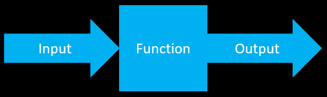

# 30 min snakemake tutorial

## Goals

* Provide a simpler introduction to snakemake compared to the official documentation

* Understand desirable qualities of a data analysis project

* Understand what a workflow is

* Understand how to structure a project directory

* Run a snakemake workflow

## Contents

0. [The quest for reproducibility](#the-quest-for-reproducibility)

1. [Workflows](#workflows)

2. [Snakemake tutorial](#snakemake-tutorial)

3. [Where to go from here](#where-to-go-from-here)

4. [Helpful links](#helpful-links)

5. [Final thoughts](#final-thoughts)

## The quest for reproducibility

People talk a lot about reproducibility. Some argue that science is in a reproducibility crisis, while others argue that [such a crisis doesn't exist](https://doi.org/10.1073/pnas.1708272114).

Many alleged reproducibility issues stem from the inconsistent ways scientists analyze data and write code. No matter how you feel about reproducibility, it's hard to deny that reproducible code will at least make your science easier and more productive. But what actually makes code reproducible? 

Some qualities of reproduciblity include:

* readability: code can be easily understood by humans

* portability: code still works even when transferred between computers with different environments

* modularity: I can swap functional chunks of code between scripts

* transparency: the exact values of every parameter are clearly specified

* scalability: code still works even if the size of the input data changes

In addition, I also like to add:

* parallelizability: data can be processed over an arbitrary number of cores

* accessibility: data can be accessed at little cost to the user in terms of money and time

Can you think of other qualities reproducibile works have?

How can we achieve all of these awesome things? To start, we need an abstract generalized framework for how to think about data analysis.
 
## Workflows

**Workflows** are a series of functions (i.e. rules) each with defined inputs, outputs, and parameters. Here's a simple visual:



Workflows have two more defining qualities: 

* directional: information flows between functions in one direction

* acyclic: the same piece of data cannot be both the input and the output for the same function. In other words, each function must perform some modification or transformation to the data - otherwise, there's no reason to apply the function in the first place. 

These terms probably give you a hint that workflows can be visualized as a graph, where the nodes are rules and the edges define how the outputs of one rule serve as the input to the next rule and so on.

We also want to think in terms of backwards design. In other words, define what the final outcome is that you want, then figure out the steps you need to do in order to get that final outcome. We build workflows by specifying the exact output that we want. From there, the necessary input are inferred.

Interestingly, it is possible for a rule to have an input but no output, or an output but no input. Although this sounds weird, it doesn't violate the above conditions. Usually the first and last rules in a workflow fall in these categories.

## Snakemake tutorial

So with our general framework in mind, how can we write a reproducible analysis as a workflow?

[Snakemake](https://snakemake.github.io/) is a python-based software for building and running workflows. There are other alternatives, but snakemake is very popular.

To do the basics you don't really need python experience, but it becomes helpful later, so definitely worth picking up if you can.

So you've decided that you want to use snakemake for your next project. Great! But how do you actually use it?

###  Create project directory

Let's start at the beginning: creating a place on your computer to do all the work for one project.

This repo is structured as an example. You could start by cloning/downloading this repo to your local computer. 

If you want to make your own, it should look something like this:

```
project_directory/
- config/
- workflow/
 - Snakefile
 - rules/
 - envs/
 - scripts/
- results/
 - yyyy-mm-dd/
- src/
- doc/
- README.md
- LICENSE.md
```

The important directories to notice are:

* `doc/` contains general notes that you may add to as your read papers, get ideas, etc.

* `src/` contains code you need to create the structured dataset that you then input into snakemake 

* `results/` contains subfolders with dates where you put analyzed data and figures that require interpretation

* `workflow/` contains all snakemake workflow components (see next sections)

* `config/` contains the initial input files for the workflow (usually a csv of sample information and a yaml file of parameter values)

Ideally, this directory should be hosted on github so that all changes are tracked and backed-up.

### Installing snakemake

As of 2023-04-06, you can access a snakemake module on the MSU ICER HPCC with:

`ml -* snakemake/5.26.1-Python-3.8.2`

However, this is an older version of snakemake(v5.26). I recommend installing the newest version (v7.25) as a conda environment.

`conda create -n snakemake snakemake=7.25.0`

### The components of a rule - fundamentals

Once you download this repo, open `workflow/Snakefile` and you should see this:

```
rule my_rule:
        input: "../config/input.txt"
        output: "output.txt"
        shell: "cp {input} > {output}"
```

In this case, we have one rule `my_rule` that takes as input one file `input.txt` in our config folder, then applies `cp` shell command to produce `output.txt`.

Before running snakemake, let's verify that it will behave as expected.

`snakemake -n output.txt`

Here `-n` means to do a dry run. This is where you see what snakemake *would* do if you executed it, without actually executing it. You should get output like this (with snakemake v7.25):

```
Building DAG of jobs...
Job stats:
job        count    min threads    max threads
-------  -------  -------------  -------------
my_rule        1              1              1
total          1              1              1


[Thu Apr  6 09:49:28 2023]
rule my_rule:
    input: ../config/input.txt
    output: output.txt
    jobid: 0
    reason: Missing output files: output.txt
    resources: tmpdir=/tmp

Job stats:
job        count    min threads    max threads
-------  -------  -------------  -------------
my_rule        1              1              1
total          1              1              1

Reasons:
    (check individual jobs above for details)
    missing output files:
        my_rule

This was a dry-run (flag -n). The order of jobs does not reflect the order of execution.
```

It takes a bit to unpack, but this is essentially just a breakdown of what rules must be run and the number of times each rule must be run in order to get your target file `output.txt`. In this case only one rule needs to be run.

To actually produce the target file, we use:

`snakemake --cores 1 output.txt`

Again, snakemake sees the final file you want, "output.txt", then figures out the rules that need to be run in order to produce that file. In this case, it just needs to apply `my_rule` one time.

### Stringing multiple rules together

In nearly all cases, you're gonna want to specify a more complicated workflow involving multiple rules. How can we accomplish this? First, we'll change the snakemake file to the following:

```
rule all:
	input: "output.txt"

include: "rules/step_one.smk"
include: "rules/step_two.smk"
include: "rules/step_three.smk"
```

You can then run the workflow with `snakemake --cores 1`.

In this case, we don't need to specify a target file. This is because, without a specified target, snakemake assumes that the first rule in the snakefile *is* the target. This is why `all` only has an input and no output.

To break this down further, our main snakefile contains a target rule `all` whose purpose is to simply list the final output files we want. The core of the workflow is instead written as three additional rules (`step_one`; `step_two`; and `step_three`) stored in separate files. Separating out the individual rules this way makes the code easier to read. If there's a problematic bit of code, we can simply go to it's `.smk` instead of scrolling through a super long `Snakefile`.

### The components of a rule - revisited

The rules we've written so far have been very simple, but I want to leave you with a taste of what snakemake can actually do. Below is a list of the different rule components you can add:

```
rule my_rule:
	input:	# input files
	output:	# output files
	params:	# parameters
	conda:	# conda environment, specified as a yaml file in envs/
	envmodules:	# environment modules
	container:	# Docker or singularity container
	log:	# log file
	threads:	# number of cores/CPUs to use
	resources:	# general place to specify any other computing resources you need (memory, run time, etc.)
	priority:	# determines whether snakemake will prefer to run some jobs sooner than others
	shell:	# contains the acutal code for the rule
```

As you can see, you have nearly limitless flexibility in specifying the behavior of each rule.

## Where to go from here

Carepentries has a very helpful [Snakemake tutorial](https://carpentries-incubator.github.io/workflows-snakemake/index.html) that is much easier to understand than the official documentation, but you'll want some python experience.

## Helpful links

[List of previously published workflows](https://snakemake.github.io/snakemake-workflow-catalog/) (**See final thoughts below**)

### Tips and best practices

[Best practices](https://snakemake.readthedocs.io/en/stable/snakefiles/best_practices.html)

[Distribution and reproducibility](https://snakemake.readthedocs.io/en/stable/snakefiles/deployment.html)

### Official tutorials

These official snakemake tutorials are rather complicated, including the ones labeled as "basic". However, they are quite practical.

["short" tutorial](https://snakemake.readthedocs.io/en/stable/tutorial/short.html)

["basic" tutorial](https://snakemake.readthedocs.io/en/stable/tutorial/basics.html)

[Advanced tutorial](https://snakemake.readthedocs.io/en/stable/tutorial/advanced.html)

### List of other skills you may want to learn

W3 schools and carpentries are good places to learn more about various topics

* [python](https://www.w3schools.com/python/)

* [github](https://www.w3schools.com/git/)

* [conda and mamba](https://carpentries-incubator.github.io/introduction-to-conda-for-data-scientists/)

* how to structre scripts (I like to use a C++ style)

## Final thoughts

Some key lessons I've learned are:

0. **Start by sketching out your desired workflow on some paper**. Some key things to figure out are the final target file(s) you want and where you want the workflow to begin.

1. **Start small and slowly add complexity**. It can be daunting to try to build an entire complex workflow from nothing. Start by building a one-step workflow. Once that works add the next step, and then the next, and so on. This also makes bugs less likely because you can identify problems before they get shrouded in complexity.

2. **Do not blindly trust workflows that people post on the internet**. It does not matter how prestigous the author is, nor how general the workflow was intended to be. Most likely, other people's workflows were wrtten with many assumptions in mind and without regard to the considerations of your specific project. Many workflows assume that you're working with human/medical data, for example. Instead of cloning other people's workflows, use them as inspiration for writing your own, or at least think critically and thoroughly test a workflow before using it.

3. **Indentation matters**. Snakemake is python-based, meaning that inconsistent indentation (e.x. switching between spaces and tabs) can be a problem. Make sure that you consistently indent your code.

4. **Always output more information than you need**. When workflows get complicated, it can be easy for unintended behaviors to go unnoticed. You can alleviate this by performing sanity checks during the coding process and printing more info from your scripts beyond what you need to test your hypotheses.
